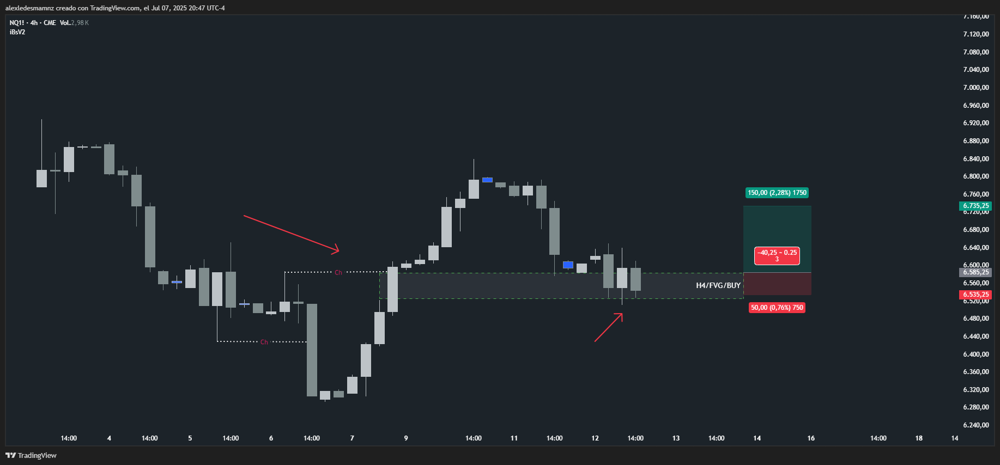

📅 Fecha del Trade: 12/01/2000
📊 Trade #001 - Nasdaq 100 (NQ)

 <!-- Asegúrate que el nombre coincida exactamente -->

📈 Detalles de la Operación
Parámetro	Valor
Riesgo	50 PTS (1.5% capital)
Beneficio	operación negativa
Ratio R/R	1:3

🎯 Análisis Técnico

Operación negativa a favor de Choch al alza sin haber formado tendencia alcista, es muy probable que el mercado esté buscando su Origen, tendré en cuenta cuando vea otros Choch (Change of Character) preferir los orígenes y no los FVG en función de origen.

📌 Lecciones Clave

Ante un Choch sin tendencia formada, priorizar la búsqueda del Origen del movimiento inmediato.

Los FVG deben evaluarse únicamente en función del Origen confirmado.

Evitar operaciones de Choch sin confirmación de estructura alcista.

💡 Reflexión Final

"El Origen define la verdadera dirección de la tendencia; operar Chochs sin tendencia clara es luchar contra la corriente"

