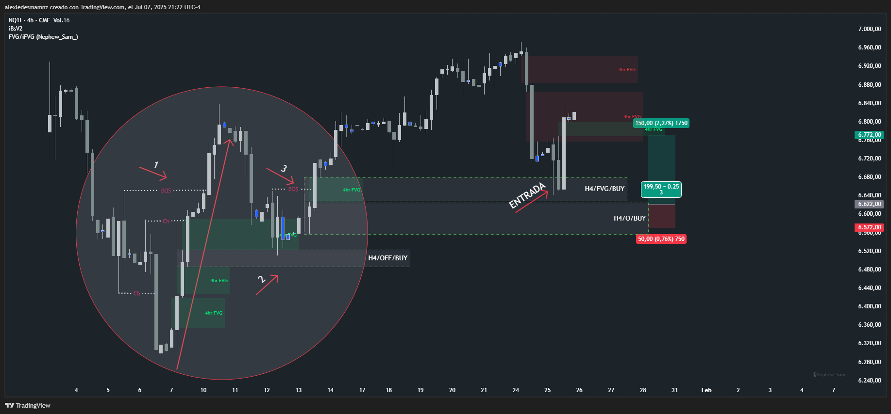

# 📅 Fecha del Trade: Martes 25/01/2000
# 📊 Trade #002 - Nasdaq 100 (NQ)

 <!-- Asegúrate que el nombre coincida exactamente -->

## 📈 Detalles de la Operación
| Parámetro       | Valor               |
|----------------|---------------------|
| **Riesgo**     | 50 PTS |
| **Beneficio**  | Operación no ejecutada|
| **Ratio R/R**  | 1:3  |

🎯 Análisis Técnico
En este trade de continuación la operación no se ejecutó debido a que me quedé esperando en el Origen H4 y el precio reaccionó en un FVG H4 encima del origen dentro de la estructura del BOS. En el trade anterior dije que no había tendencia alcista confirmada pero realmente si la había porque como se ve en el círculo de la gráfica no solo tengo Choch, también tengo BOS y luego un nuevo BOS (continuación) que fue donde reaccionó el mercado para continuar alcista sin tocar mi orden en el Origen.

📌 Lecciones Clave
En operaciones de continuación, no esperar únicamente en el Origen H4 si el precio reacciona en FVG H4 dentro del BOS

Confirmar tendencia alcista con presencia de Choch, BOS y nuevo BOS (continuación)

Los FVG dentro de estructura BOS son zonas de reacción válidas para continuación

💡 Reflexión Final
"La estructura completa (Choch y BOS) define la continuación; esperar solo en Origen hace perder reacciones en FVG dentro del BOS"
---