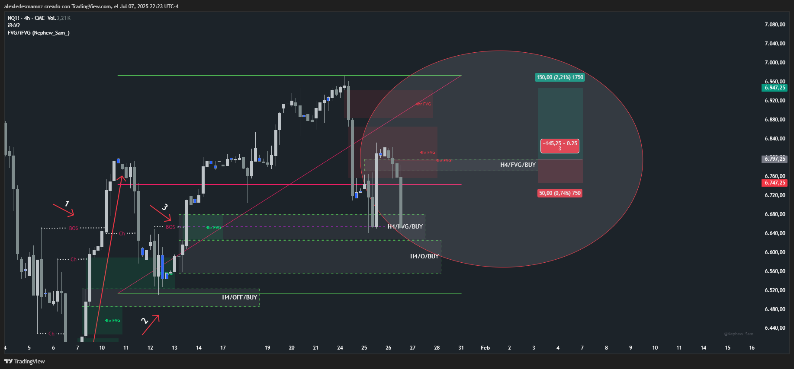

# 📅 Fecha del Trade: 26/01/2000
# 📊 Trade #003 - Nasdaq 100 (NQ)

 <!-- Asegúrate que el nombre coincida exactamente -->

## 📈 Detalles de la Operación
| Parámetro       | Valor               |
|----------------|---------------------|
| **Riesgo**     | 50 PTS (1.5% capital) |
| **Beneficio**  | Operación negativa |
| **Ratio R/R**  | 1:3             |

## 🎯 Análisis Técnico
Operación negativa en FVG H4 sin estructura, sin Choch ni BOS, hay que evitar estos escenarios siempre que sea posible.

## 📌 Lecciones Clave
Nunca operar en FVG H4 sin estructura técnica confirmada

La presencia de Choch y BOS es requisito imprescindible antes de cualquier entrada

Evitar escenarios sin confirmación estructural reduce operaciones negativas

## 💡 Reflexión Final
"Los FVG sin estructura son trampas del mercado; la verdadera ventaja está en esperar confirmación de Choch y BOS"