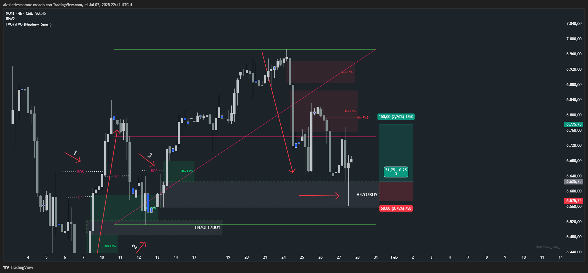

# 📅 Fecha del Trade: 27/01/2000
# 📊 Trade #004 - Nasdaq 100 (NQ)

 <!-- Asegúrate que el nombre coincida exactamente -->

## 📈 Detalles de la Operación
| Parámetro       | Valor               |
|----------------|---------------------|

| **Riesgo**       | 50 PTS (1.5% capital) |
| **Beneficio**    | Operación negativa |
| **Ratio R/R**    | 1:3              |

## 🎯 Análisis Técnico

Esta operación resultó negativa porque a pesar de que esperé mi entrada en un bloque Origen de compras en una tendencia alcista, el precio venía de zona de vendedores y estaba por debajo del 50% del rango, por lo tanto... la fuerza bajista rompió el 50% de mi bloque, para evitar estos escenarios en el futuro debo asegurarme de operar compras por encima del 50% del rango y debo hacerme las preguntas de lugar: ¿de dónde viene el precio? ¿qué está haciendo? ¿hacia dónde va?

## 📌 Lecciones Clave

Operar compras solo por encima del 50% del rango para evitar zonas de presión bajista

Verificar siempre el contexto: ¿viene el precio de zona de vendedores o tiene espacio estructural?

Validar las tres preguntas esenciales antes de entrar: ¿de dónde viene el precio? ¿qué está haciendo? ¿hacia dónde va?

## 💡 Reflexión Final

"La verdadera seguridad operativa está en comprar por encima del 50% del rango y entender el viaje completo del precio: su procedencia, acción y destino"

---

🔍 **Ver análisis completo**: [Estrategia.md](estrategia.md) | [Datos brutos](/data/trade_009.csv)