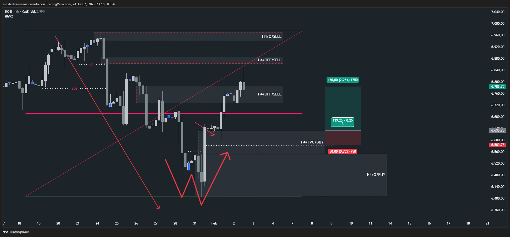

# 📅 Fecha del Trade: 01/02/2000
# 📊 Trade #005 - Nasdaq 100 (NQ)

 <!-- Asegúrate que el nombre coincida exactamente -->

## 📈 Detalles de la Operación
| Parámetro       | Valor               |
|----------------|---------------------|
| **Zona Entrada** | --- |
| **Zona Salida**  | --- |
| **Riesgo**       | 50 PTS |
| **Beneficio**    | 150 PTS |
| **Ratio R/R**    | 1:3   |

## 🎯 Análisis Técnico

Como se puede ver en la gráfica el mercado me creó un nuevo rango esta vez bajista rompiendo W, dejándome varios bloques de ventas muy difíciles de operar por su gran tamaño (bloques muy caros) y porque la caída fue tan brusca que esperar un trade en el origen de ventas era casi imposible.

Al final decidí seguir extendiendo el rango a la baja hasta que el mercado hizo Choch con cuerpo girando el mercado al alza, este patrón de giro ya descartaba todas las zonas de ventas, así que me posicioné en un FVG H4 de compras encima del Origen H4, fue arriesgado operar este FVG H4 al open porque el mercado podía buscar el Origen más abajo pero confié en la fuerza alcista, aun así debo reconocer que fue bastante arriesgado, por lo tanto si vuelvo a ver un bloque como este en el mercado real, lo mejor que puedo hacer es refinarlo en una temporalidad menor como H1 o M15 para buscar un bloque más económico que se ajuste a mi riesgo en la misma zona.

## 📌 Lecciones Clave

Ante bloques de venta grandes en caídas bruscas, refinar la entrada en temporalidades menores (H1/M15) para bloques más económicos.

Operar FVG H4 solo con confirmación de giro alcista (Choch con cuerpo) que invalide zonas anteriores (ventas).

Aceptar el riesgo controlado al operar FVG cerca del Origen cuando hay fuerza direccional clara.

## 💡 Reflexión Final
"Los bloques caros requieren refinamiento en menores temporalidades; un Choch de giro invalida zonas anteriores y justifica FVG arriesgados con gestión controlada"---
