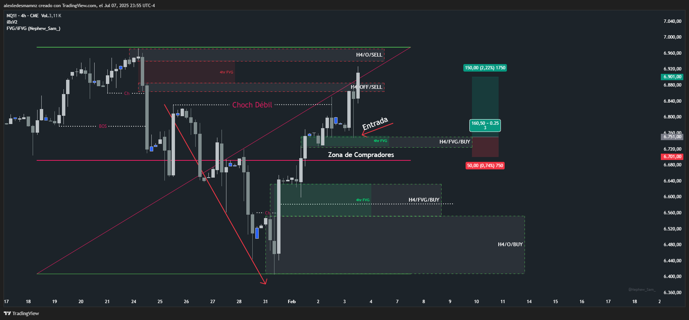

# 📅 Fecha del Trade: 03/02/2000
# 📊 Trade #006 - Nasdaq 100 (NQ)

 <!-- Asegúrate que el nombre coincida exactamente -->

## 📈 Detalles de la Operación
| Parámetro       | Valor               |
|----------------|---------------------|
| **Zona Entrada** | --- |
| **Zona Salida**  | --- |
| **Riesgo**       | 50 PTS |
| **Beneficio**    | 150 PTS (Trade exitoso)  |
| **Ratio R/R**    | 1:3           |

## 🎯 Análisis Técnico

Al encontrarme por encima del 50% del rango y reconociendo que estaba en una tendencia alcista perfectamente clara y al observar que el mercado rompió con mecha (Choch Débil) la estructura bajista previa, era claro que vendría un retroceso, la tendencia alcista a estas alturas me había dejado un FVG H4 por encima del 50% del rango (zona de compradores), no estaba seguro hasta donde llegaría el retroceso a la baja pero el contexto general me dió la seguridad para operar en largo, además mi stop cubría bastante bien el bloque para aguantar una volatilidad más o menos fuerte.

El resultado se puede ver en la gráfica, el mercado tocó justo al open del bloque y se fue a mi favor dándome 150 puntos de profit.

## 📌 Lecciones Clave

Operar en FVG H4 por encima del 50% del rango en tendencia alcista clara

Confirmar rupturas de estructura bajista previa (Choch débil con mecha) como señal de retroceso

Utilizar stops que cubran el bloque para absorber volatilidad en retrocesos

## 💡 Reflexión Final
*"La combinación de estructura alcista clara + FVG H4 sobre 50% del rango + stop protector es la trinidad del trading confiable"*
