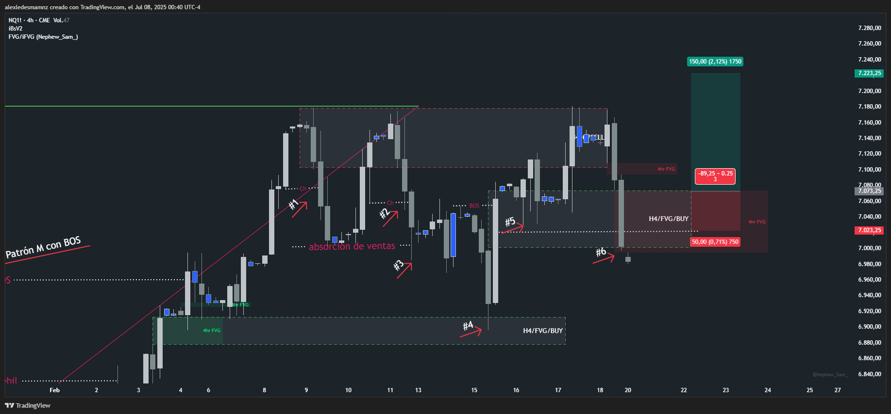

# 📅 Fecha del Trade: 16/02/2000
# 📊 Trade #007 - Nasdaq 100 (NQ)

 <!-- Asegúrate que el nombre coincida exactamente -->

## 📈 Detalles de la Operación
| Parámetro       | Valor               |
|----------------|---------------------|
| **Zona Entrada** | --- |
| **Zona Salida**  | --- |
| **Riesgo**       | 50 PTS |
| **Beneficio**    | Operación negativa |
| **Ratio R/R**    | 1:3              |

## 🎯 Análisis Técnico

Aquí me enfrenté a una estructura de manipulación debido a una gran lateralización de mercado casi imperceptible y además por las siguientes razones:

#1. Choch que cierra rango a la baja y es cancelado para continuar alcista.

#2. Segundo Choch a la baja que también es cancelado para volver a subir los precios. 

#3.  

## 📌 Lecciones Clave
1. La paciencia en zonas de origen aumenta probabilidad
2. Los bloques FVG con volumen son altamente confiables
3. El riesgo controlado permite soportar volatilidad

## 💡 Reflexión Final
*"El mercado recompensa la disciplina en zonas clave más que la frecuencia operativa"*

---

🔍 **Ver análisis completo**: [Estrategia.md](estrategia.md) | [Datos brutos](/data/trade_009.csv)